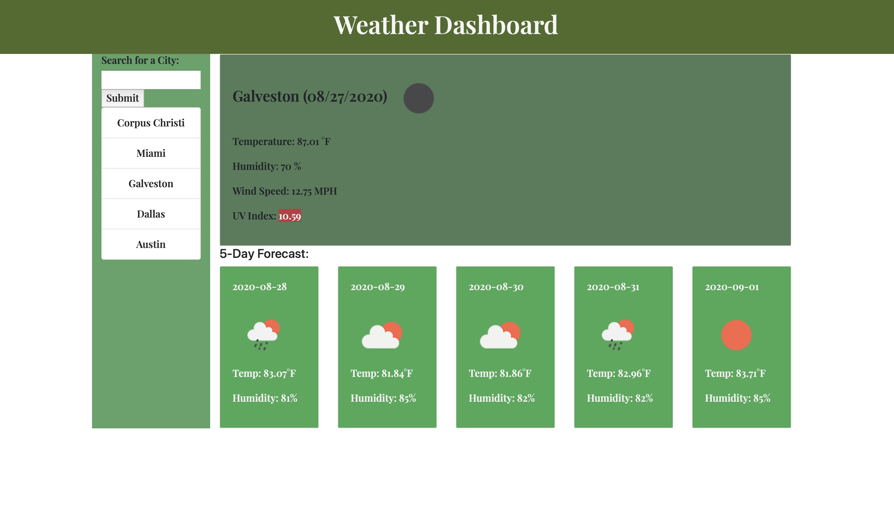
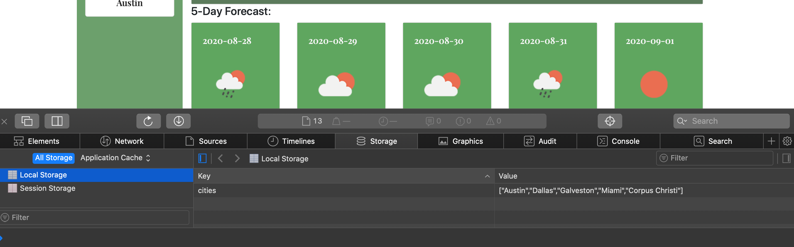

# Weather Dashboard

# Description
This app is designed to provide weather data using apis.  When a user enters a city in the search box, the current weather data for that city is displayed on the right upper section along with the City name and current date.  Below this section the 5-day forecast is displayed.  The history of city inputs is stored as buttons below the input box allowing the user to go back and view weather data for their most recent city searches.  Search history is stored locally so this data is still viewable if the page is refreshed or reloaded. 

# Technologies used
- Html, CSS, Javascript

# Link to Application
https://jasandper.github.io/Weather-App/

# Screenshots

# Contact Information
Jason Perez jasandper@icloud.com